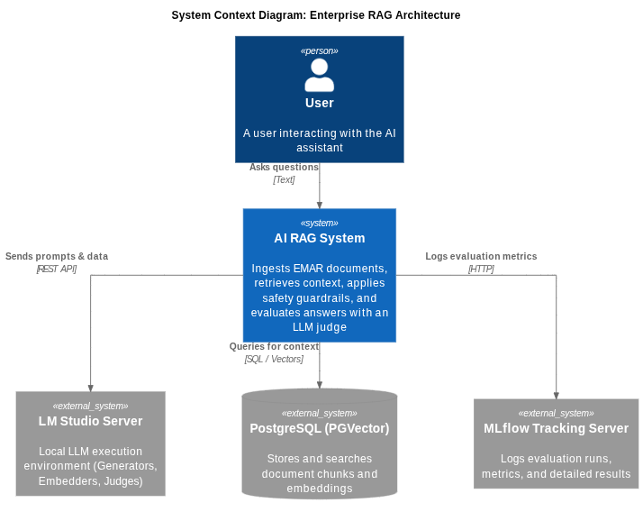
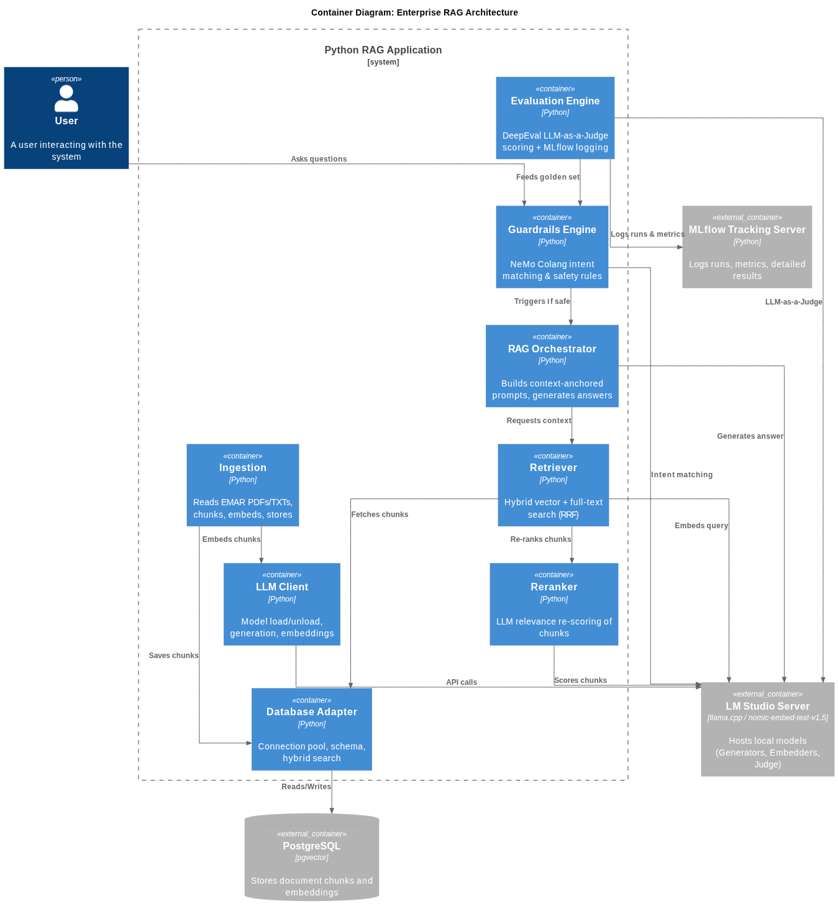
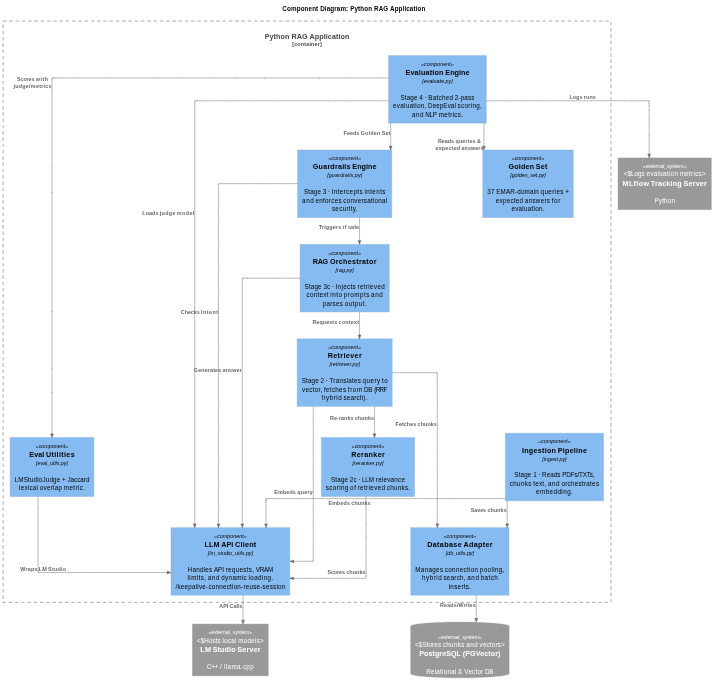
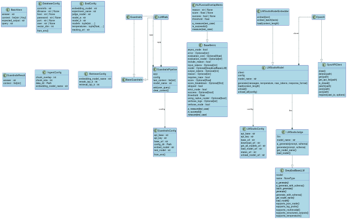
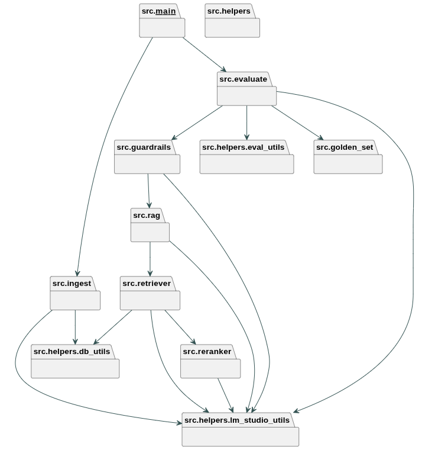

# nlpg-6ed-group-4

Sistema **RAG** que compara dois LLMs open-source — **Ministral-3B** (`ministral-3-3b-instruct-2512`) vs **Qwen-3.5-2B** (`qwen3.5-2b`) — na resposta a consultas sobre o dataset **EMAR** (6 regulamentos de aeronavegabilidade militar: EMAR 21/66/145/147/CAMO/M).

## Arquitetura

O pipeline é executado em 4 etapas sequenciais:

| Etapa | Papel | Ficheiros |
|---|---|---|
| **INGEST** | Lê PDF/TXT → chunking sentence-aware (500 carateres, overlap 50) → embeddings → pgvector | `src/ingest.py`, `src/helpers/db_utils.py` |
| **RETRIEVE** | Busca híbrida (vetorial + FTS, combinada por RRF) + re-ranking | `src/retriever.py`, `src/reranker.py` |
| **GUARDRAILS / RAG** | NeMo Guardrails (fluxos Colang) + geração de resposta | `src/guardrails.py`, `src/rag.py`, `nemo_config/` |
| **EVALUATE** | LLM-as-a-judge com DeepEval + logging em MLflow | `src/evaluate.py`, `src/helpers/eval_utils.py`, `src/golden_set.py` |

## Stack

- **PostgreSQL + pgvector** — índice IVFFlat no embedding + índice GIN para full-text search (busca híbrida com RRF).
- **LM Studio** — inferência local de LLMs e embeddings (API compatível com OpenAI).
- **NeMo Guardrails** — fluxos de segurança (política, ilegal, toxidade, classificado, jailbreak) + PII masking.
- **DeepEval** — métricas Faithfulness, Answer Relevancy + métrica léxica Jaccard personalizada.
- **MLflow** — registo de runs e resultados da avaliação.
- **Python 3.14** com `uv` (`.python-version`).

## Setup

```bash
uv sync                    # cria o .venv e instala as dependências
docker compose up -d       # PostgreSQL 16 + pgvector
uvx mlflow server --host 127.0.0.1 --port 5000   # num terminal à parte
```

- Garantir que o **LM Studio** está a correr em `http://localhost:1234/v1` (configurável via `LLM_BASE_URL`).
- Copiar `.env.example` → `.env` e ajustar nomes dos modelos/portas.
- `OPENAI_API_KEY` é dummy (exigida pelo DeepEval); as chamadas reais vão para o LM Studio.

## Run

```bash
uv run python src/__main.py__   # ingest + evaluate
uv run python src/ingest.py     # apenas a etapa de ingestão
```

## Configuração chave (`.env.example`)

| Variável | Valor |
|---|---|
| `MODEL_A` / `MODEL_B` | `ministral-3-3b-instruct-2512` / `qwen3.5-2b` |
| `JUDGE_MODEL` | `deepseek-ai_deepseek-r1-0528-qwen3-8b` |
| `EMBEDDING_MODEL_NAME` / `VECTOR_DIM` | `text-embedding-nomic-embed-text-v1.5` / `768` |
| `CHUNK_SIZE` / `CHUNK_OVERLAP` | `500` / `50` |
| `RETRIEVAL_TOP_K` / `RERANK_TOP_K` | `500` / `10` |

O sweep de avaliação usa **3 temperaturas** `(0.0, 1.0, 2.0)` por modelo.

## Estrutura do repositório

```
src/            # pipeline (ingest, retriever, rag, guardrails, evaluate, reranker, golden_set)
nemo_config/    # config.yml + rails.co (Colang)
data/           # PDFs de origem (6 regulamentos EMAR)
documentation/  # documentação, diagramas C4 e relatórios
```

## Diagramas C4

Fonte (`.puml`): `documentation/C4/`. Imagens: `documentation/C4/Images/`.

**Nível 1 — Contexto** (`L1.png`):


**Nível 2 — Containers** (`L2.png`):


**Nível 3 — Componentes** (`L3.png`):


**Nível 4 — Código** (`L4_Classes.png` / `L4_Packages.png`):



Regenerar o nível 4:

```bash
PYTHONPATH=src uv run pyreverse -o puml -a 1 -s 1 -p c4_level4 __main__ evaluate golden_set guardrails ingest rag reranker retriever helpers
```

## Documentação

- [`documentation/pipeline-cycle.md`](documentation/pipeline-cycle.md) — ciclo do pipeline (INGEST → RETRIEVE → RAG → EVALUATE)
- [`documentation/Notas_Relatorio.md`](documentation/Notas_Relatorio.md) — notas para o relatório final
- [`documentation/Golden_Set.md`](documentation/Golden_Set.md) — golden set de avaliação (37 queries EMAR)
- [`documentation/dataset-llama-insights.md`](documentation/dataset-llama-insights.md) — insights do run com o juiz anterior
- [`documentation/prompt_apresentacao_pptx.md`](documentation/prompt_apresentacao_pptx.md) — prompt para gerar a apresentação
- [`documentation/estrutura_apresentacao.md`](documentation/estrutura_apresentacao.md) — estrutura da apresentação
- [`documentation/future-work.md`](documentation/future-work.md) — trabalho futuro

## Créditos

Vítor Antunes | José Galão | Raquel Rocha
